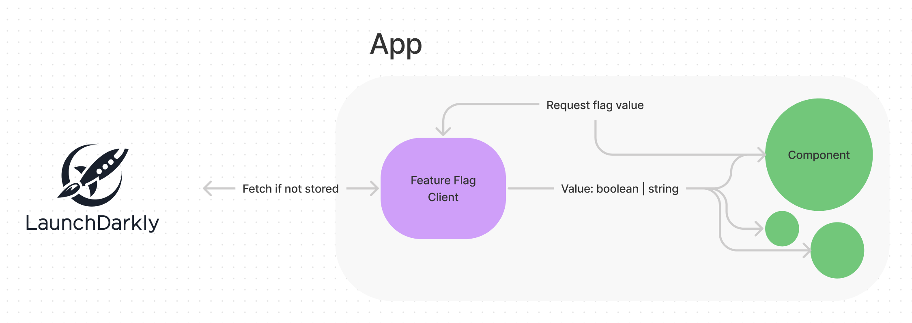

# **Getting Started**

### **Requirements**

- Git
- Node
- Yarn

### Install dependencies

`yarn`

### **Running the app**

`yarn start`

### **Running your tests**

`yarn test`

# Context

At Eucalyptus, we often release features into production multiple times a day. To do this iteratively & reliably, we enlist the help of **Feature flags** to have control over when, and how our features are released.

Here is some more information on the concept in case you're curious:

[https://launchdarkly.com/blog/what-are-feature-flags/](https://launchdarkly.com/blog/what-are-feature-flags/)

To leverage these feature flags, we often create a **Feature flag client.** This client acts as an interface between our feature flag provider (LaunchDarkly) and a customer application, written in React.

## Problem

We would like you to create a feature flag client, that would be used to provide feature flag values to a frontend application. Integrating with our provider LaunchDarkly, the client should be responsible for fetching, storing, and accessing these values in a React application.

We have provided a few things for you to get you started,

- A very basic frontend application for you to get started with, that contains a login screen & two application screens. Feel free to update the structure as you wish
- A LaunchDarkly project that is serving three feature flags. You can find the access key in the repository (as well as some details)
- Please use this Javascript SDK (launchdarkly-js-client-sdk dependency) to integrate with LaunchDarkly:[https://docs.launchdarkly.com/sdk/client-side/javascript](https://docs.launchdarkly.com/sdk/client-side/javascript)

### Requirements

- The application must have access to all feature flag values at all times.
- The application can fetch, store, and serve the **correct** flag values for a user.
- These components are rendered (differently) based on these flag values. We have left comments in these components with instructions
  - Page layout (launch banner)
  - Medication Details
  - Request review button
- A useful set of helpers to interact with these flag values.
- An event with relevant information is fired when a feature flag value is evaluated, i.e determines what to render. Don't worry about actually sending the event (a console.log is fine), but more so around the setup & logic to do so correctly. This event should contain information about the user & feature flag.

## Tips

We'll be looking for:

- A well-designed and extensible implementation.
- Production quality code.
- Useful and well-structured tests.
- Clearly communicated assumptions, and a description of any extensions you don't get time for.
- A functionally correct solution (we'll be running the solution & testing it against different flag configurations).
- Error scenarios considered
